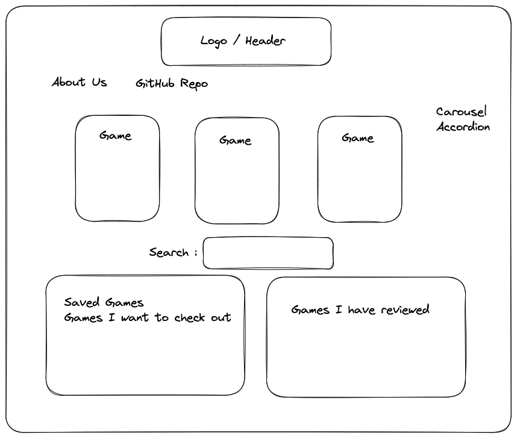
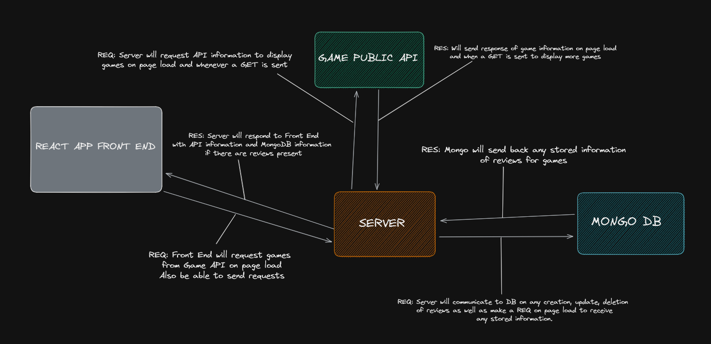
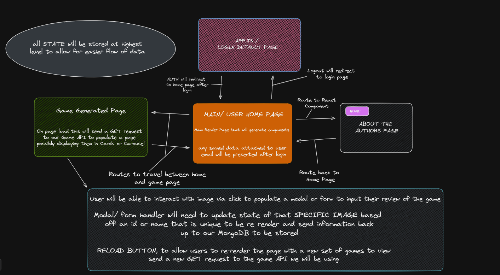
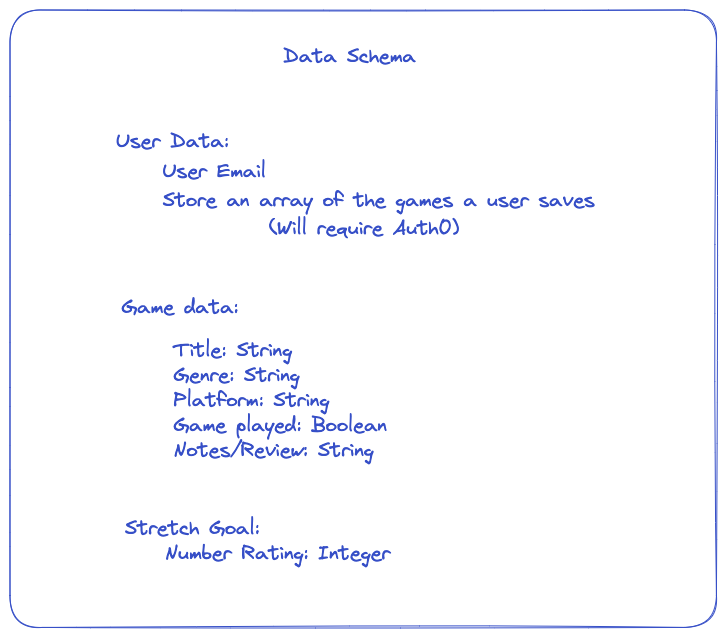

# Review-Site-FrontEnd

## Authors: DaJon, Laurence, Reece, Sarah

## Project Description:

We are creating a game review site that will allow users to create, update, delete and retrieve reviews out of our established database.  We will be utilizing MongoDB to create our database and host our server with Render.  We will be developing our Front End using React and deploy through Netlify.  We will have full CRUD functionality within our database and implement multiple components within React to render our page.

The problem or pain point we are looking to solve is to create a place for users to explore online games, track games they're interested in, and create reviews for games they have played.

## Free To Game API

https://www.freetogame.com/

## Wireframing

## Domain Modeling

## Data Schema

